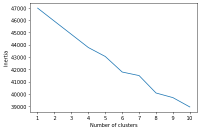

# Cryptocurrency Clusters

## Background
A prominent investment bank, is interested in offering a new cryptocurrency investment portfolio for its customers. We will be helping determine whether cryptocurrencies currently trading can be grouped to create a classification system.

There is no known classification system for cryptocurrency, and so we will first need to process the raw data to fit machine learning models to use unsupervised learning. Several clustering algorithms will be used to explore whether cryptocurrencies can be grouped together with other similar cryptocurrencies.

## Data Preparation
* Read `crypto_data.csv` into Pandas. The dataset was obtained from [CryptoCompare](https://min-api.cryptocompare.com/data/all/coinlist).
* Filtered for currencies that are currently being traded.
* Removed all rows that have at least one null value.
* Filtered for cryptocurrencies that have been mined.
* Dataset features with text, including `Algorithm` and `ProofType`, were converted into numerical data to be comprehensible to a machine learning algorithm.
* Dataset was standardized so that columns that contain larger values do not undully influence the outcome.

## Dimensionality Reduction
The number of cryptocurrency features dramatically increased when we converted features with text to numerical values.

We used dimensionality reduction with PCA (Principal Component Analysis) to create a model that will preserve approximately 90% of the explained variance.

The dataset dimensions were then further reduced with t-SNE (t-distributed stochastic neighbor embedding).

## Cluster Analysis with k-Means
An elbow plot was visualized to see if we could determine the best number of clusters.
 

  

 

Our findings were that we could not determine where the elbow of the plot was.

 
There are many dimensions to existing cryptocurrencies that make clustering them extremely difficult.

The number of clusters you select will be dependent on your business use case, meaning a universal classification system does not exist.